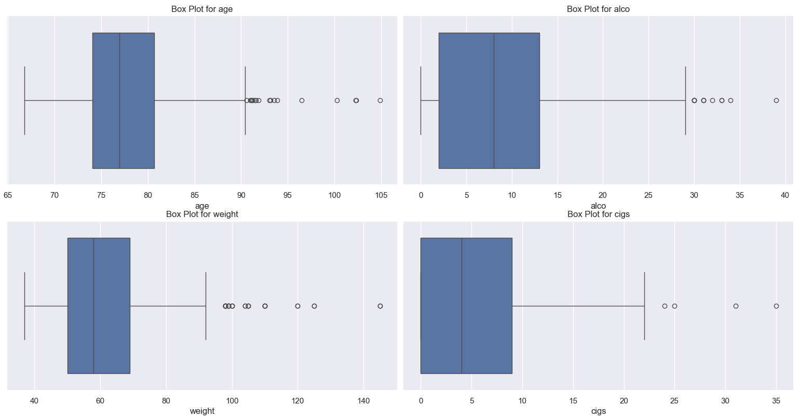

# Heart-Disease-Predicting-Model
The objective of this model was to predict likelihood of heart disease merely using simple factors like age, alcohol consumption, cigarettes smoked and weight. I started off by getting a dataset from kaggle of around 1000 patients. Around 400 of them had null values, therefore all the rows were omitted. The numbers of 1 and 0 in heart disease column were changes to yes and no respectively.
The independent variable was Heart Disease while the independent varibales were age, alcohol consumption, cigarettes smoked and weight
Boxplots were then plotted to identify any outliers; many outliers were found but since they represented important part of the data and other inputs seemed credible enough, none of the outliers were removed.
# Boxplot---->

Then normality was assessed by creating kde plots. Our data was mostly skewed.
# KDE PLlot ---->

Therefore we decided to perform 2 Logistic regressions: One would be done with the data we have( Model A)  and the other would be done by transforming the data to make it look more normal using log function(Model B). And then the model with better predictability would be used.
The logistic regression results reported that Model A had a higher pseudo r square value of 0.1185 while Model B had 0.07953 indicating that the trying to make the data look normal from skewed using log function deteriorated the model's overall fit and its ability to explain the variance in the dependent variable. Although both were statistically significant, model A also had a lower LLR P-value, showcasing slightly higher significance.
Therefore Model A was chosen for the predicting Heart Disease probability. However, it was seen that weight barely had any importance in our results since it’s p value was also 0.64. Hence, it was decided to omit it.
One final Logistic regression was run excluding weight which had pseudo r square value of 0.1182 (almost same as the previous one) and a LLR p-value of 2.355e-17 ( Higher in significance )  So the second model was chosen for predcting.
Logistic Regression plot ---->

The final model results show that Age, Alcohol consumption, and Cigarette smoking are all statistically significant predictors of heart disease, as evidenced by their P-values. Both Age and Alcohol are highly significant (P<0.001), with coefficients of 0.0906 and 0.0884 respectively, indicating they carry nearly identical weight in increasing the risk score. Cigarettes also proved significant (P=0.006), though its coefficient of 0.0481 suggests a slightly lower impact per unit compared to the other two factors. Because all coefficients are positive and their confidence intervals do not cross zero, the data confirms a direct, reliable link between an increase in these habits and an increase in heart disease likelihood.

Results of all the Logistic Regression in details

